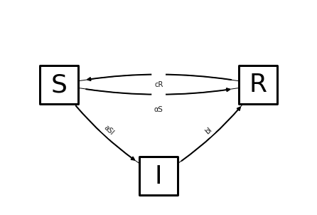
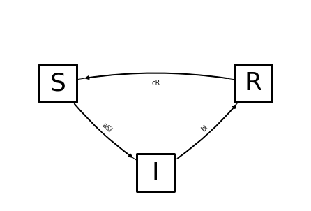

# TEAM MAGIC 8 BALL

---
## Team Members
- [Shania Thomas](https://www.linkedin.com/in/shania-thomas-atx22/)
- [David Cherney](https://www.linkedin.com/in/dmcherney/)
- [Afolabi Cardoso](https://www.linkedin.com/in/afolabi-cardoso/)
- [Thomas Prich](https://www.linkedin.com/in/thomas-prich/)
---
## Content

[Problem Statement](#Problem-Statement) | [Data](#DATA) | [Methodology](#Methodology) | [Conclusions and Recommendations](#Conclusions-and-Recommendations)

---

## Problem Statement
The Federal Department of Health has put together a team of data scientists to help investigate the COVID-19 outbreaks of 2020 and 2021. By comparing both SIR and ARIMA models using national COVID-19 data from the CDC, we want to determine if SIR or ARIMA is a better predictor of new COVID-19 infections.

---
## DATA

[United States COVID-19 Cases and Deaths by State over Time](https://data.cdc.gov/Case-Surveillance/United-States-COVID-19-Cases-and-Deaths-by-State-o/9mfq-cb36)

[Population data from census.gov](https://www.census.gov/data/datasets/time-series/demo/popest/2010s-state-total.html#par_textimage_1873399417)

---
## Methodology

### Overview
---
#### 1) SIR model:

##### 1.1) Introducing Variables and Parameters

SIR models provide a theoretical framework for the time rates of change of three populations in an outbreak of a contageous disease. The populations in the model are given the shorthand 
- $S$ for the number of people in the population that are suscptable to getting infected
- $I$ for the number of people that are infected
- $R$ for the people that are recovered from the disease (and are therefore imune, possibly only temporarily)
The three populations exchange members as time goes on as shown in the diagram below. For example, suscepable people become infected. The following directed graph shows the exchanges in the model with $a,~b,~c,$ and $\alpha$ as arbitary numbers. 

- $a$ is called **transmissability**
- $b$ is called **recovery rate**
- $c$ is called **deimunization rate**

##### 1.2) Simple SIR 
As a simple example of an SIR model, consider the case where 
- recovered people never become susceptable, which corresponds to the value $c=0$,
- no vaccine exists, so susceptable people never become recovered without first becoming infected, which corresponds to $\alpha = 0$. 
- The total population is 1 in units of millions (and, to further simplify, is constant). 

Then the time rates of change of the three categories are descibed by the non-linear ordinary differential equaiton

<!-- $$\frac{d}{dt}\left( \begin{array}{c}S \\ I \\ R  \end{array} \right) 
= 
\left( \begin{array}{c}-aSI \\ aSI -bI \\ bI   \end{array} \right) 
$$ --> 

Because the sum of the number of people in the three categries is, in our simplifying assumption, 1 million,
<!-- $$
1 =S+I+R \\
\Leftrightarrow 
R = 1-S-I.
$$ --> 

Substituting this into the differential equation and removing the third row, $R$ since that number can be recovered from $S$ and $I$, yields 
<!-- $$\frac{d}{dt}\left( \begin{array}{c}S \\ I  \end{array} \right) 
= 
\left( \begin{array}{c}-aSI \\ aSI -bI    \end{array} \right) 
$$ --> 

##### 1.2.1) Equilibrium Solutions to Simple Model
A common cenceptual checkpoint is to find the so called 'equilibrium solutions' to the differential equation. These are the constant functions that are solutions. Constant means that time rate of change is zero, and thus the equilibrium solutions are the solutions to 
<!-- $$\frac{d}{dt}\left( \begin{array}{c}S \\ I  \end{array} \right) 
= \left( \begin{array}{c}0 \\ 0    \end{array} \right) $$ --> 

<!-- $$\Leftrightarrow 
\left( \begin{array}{c}-aSI \\ aSI -bI    \end{array} \right) 
= \left( \begin{array}{c}0 \\ 0    \end{array} \right)$$ --> 

<!-- $$\Leftrightarrow 
\left\{ \begin{array}{c}-aSI =0 \\ \rm{and}\\ aSI -bI =0    \end{array} \right\} 
\Leftrightarrow 
\left\{ \begin{array}{c}S =0 \rm{~OR~} I=0 \\ \rm{and}\\ aSI = bI     \end{array} \right\} 
$$ --> 

 

<!-- $$
\Leftrightarrow 
\left\{ \begin{array}{c}S =0 \rm{~and~} I=0 \\ \rm{OR}\\ I=0 \rm{~and~} 0 = 0     \end{array} \right\} 
$$ --> 

The first conjunction of equations describes the equilibrium solution 

<!-- $$
\left\{ \begin{array}{c}S(t) \\ I(t) \\ R(t) \end{array} \right\} 
= \left\{ \begin{array}{c} 0  \\ 0 \\  1 \end{array} \right\},
$$ --> 

an equilibrium state in which all 1 million people in the population have recovered and will never be susceptable or infected again. 

The second conjunction of equations describes the equilibrium solutions of the form 

<!-- $$
\left( \begin{array}{c}S(t) \\ I(t) \\ R(t) \end{array} \right) 
= \left( \begin{array}{c} S_0  \\ 0 \\  1-S_0 \end{array} \right),
$$ --> 

which are equilibrium states in which some number $S_0$ of people are susceptable, some recovered, but since $0$ people are infected these numbers do not change in time. 

##### 1.2.2) Conditions of decrease in infections: Herd Immunity
In this simplified model, the condition for the number of infections to be decreasing in time 
<!-- $$
\frac{d}{dt} I <0\\
\Leftrightarrow
aSI-bI <0\\
\Leftrightarrow
S < \frac{b}{a}.
$$ --> 

That is, the disease begins to die out when less than $b/a$ people in the population remain susceptable. This is the point known as 'herd immunity'.

In the following sectoins we will find the expression for heard immunity in the more complicated cases of the SIR model. 

##### 1.3) SIR with no vaccine
If the only SIR model parameter (from $a,b,c,\alpha$) set to zero is the vaccination rate $\alpha$ then the modeling differntial equation becomes 

<!-- $$\frac{d}{dt}\left( \begin{array}{c}S \\ I \\ R  \end{array} \right) 
= 
\left( \begin{array}{c}-aSI+cR \\ aSI -bI \\ bI-cR   \end{array} \right) 
$$ --> 

and again the her immunity is the condition $\frac{d}{dt} I < 0 \Leftrightarrow S <\frac{b}{a}$.

The question obecomes how to approach this sufficiently small value of $S$. The first component of the equation above reads
<!-- $$
\frac{d}{dt} S = -aSI +CR
$$ --> 

and we see a term desribing decreases $-aSI$ and a term describing increase. To head toward herd iimmunity, we want the decreasing term to win.  

Since the total population $p=S+I+R \Leftrightarrow R=p-S-I$, the rate of change of $S$ is also 
<!-- $$
\frac{d}{dt} S = -aSI +C(p-I-S) =  -cS -(aS+c)I +cp
$$ --> 

In the last expression we see a term describing increase ($-cp$) and two terms describing decrease ($-cS -(aS+c)I$). What can vaccines do to hasten heard immunity? 

##### 1.4) SIR With Vaccine

If a vaccine is administered to $\alpha$ percent of the susceptable population each unit of time (e.g. ten percent every week) the the differential equation describing the populations becomes
<!-- $$\frac{d}{dt}\left( \begin{array}{c}S \\ I \\ R  \end{array} \right) 
= 
\left( \begin{array}{c}-\alpha S-aSI+cR \\ aSI -bI \\ bI-cR   \end{array} \right) , 
$$ --> 

the condition for herd immunity remains 
<!-- $\frac{d}{dt} I < 0 \Leftrightarrow S <\frac{b}{a}$ --> 

and, again impositing the constant population condition <!-- $R=p-S-I$ --> , the rateof change of $S$ is 
<!-- $$
\frac{d}{dt} S =   -(c+\alpha)S -(aS+c)I +cp. 
$$ --> 

 

One sees that  one of the terms desribing a decrease in the susceptable population now desrcibes a more rapid decrease. 

### $-(c+\alpha)S$ has replaced $-cS$ . 

In this way, vaccination hastens the approach toward herd imunity

#### 2) Realistic values of parameters $a$ and $b$
##### 2.1) Toward Realistic $b$

In SIR models, the term $-bI$ in the differential equation
<!-- $$
\frac{dI}{dt} =  aSI - bI,
$$ --> 

 
describes the rate at which infected people move into the recovered compartment. 

It is common knowledge that a case of COVID lasts about two weeks, or 14 days. 
For this reason we use 
<!-- $$b =\frac{1}{14{\rm days}}.$$ --> 

As an example of why this is an intuitive value,
if 
 
<!-- $b =\frac{1}{14{\rm days}} \rm{~ and~} I=14{\rm people}$ --> 

 
then the number of people who recover in a day is 
<!-- $bI = 1 \frac{\rm person}{\rm day}.$ --> 

##### 2.2) Toward realistic $a$
##### 2.2.1) Introducing Reproductive Number Through Exponential Models 

SIR models are improvements upon expontial models in that 
- exponential models treat the susceptable population as infinitely large, 
- SIR models take into account that the susceptable population is finite and changes size. 

In an exponential growth model of disease transmission each infected person, over the duration of their infection, infects some number of susceptable people. This number is called **the reproductive number** of the disease. 

**If the reproductive number of a disease is less than 1 then the disease will die out.** 

To make this idea quantitative, let $b$ be the recovery rate (so $1/b$ is the durration of disease) and number $r_0$ be the reproductive number of a disease. 
The differential below above is then interpreted as "each day each infected person infects $r_0 b$ other people."

<!-- $$\frac{dI}{dt} = r_0 b  I.$$ --> 

This is called an exponential model because the solutions ($I$ as a function of time $t$) are the exponential functions of the form
<!-- $$I(t) = I_0(r_0b)^t$$ --> 

with $I(0)$ the number of infections when $t=0$. 
Changing base to Euler's number ($e$) the functions are
$$I(t) = I_0e^{\ln(r_0 b)t}.$$

The doubling time for the infection is $t_d$ such that $e^{\log(r_0 b)t_d}=2 \Rightarrow t_d = \ln(2)/\ln(r_0b).$

##### 2.2.2) Reproductive number in SIR Models
SIR models have a similar feature, the reproductive number, but the value changes in time. 

Recall that in SIR models 
$$\frac{dI}{dt} =  aSI - bI$$ 
The first term is the number of new infections per time. Compare that term to the analagous term in exponential growth models;
$$ aSI \sim r_0bI.$$
The dynamics of the two terms are different; the product $aS$ changes in time while $r_0b$ does not change in time. As a result, the exponential model grows exponentially without end, but the SIR models infections peak and then decay to 0. 

Intuitively, when almost all of the population is susceptable $S\approx p$, the growth rate of $I$ is exponential. The similarity then takes on the form 
$$ aPI \sim r_0bI \\
\Leftrightarrow 
r_0 = p\frac{a}{b}.$$
This is the reproductive number of an SIR model in terms of the transmission rate $a$, recovery rate $b$, and population $p$. 
The measured value of $r_0$ for COVID is approxinately $2.8$.
This demands that the transmission rate of covid be 
$$a =\frac{2.8 b}{p}.$$

##### 2.2.3) Effective Reproductive Rate and Herd Immunity From Another Argument

When $S$ changes to below $p$ as the infectionstarts to spread, the reproductive rate becomes an effective reproductive rate

$$
r_{{\rm eff}} = S\frac{a}{b}.
$$

The condition that the disease starts to die out 
$$
r_{\rm eff}<1 \Leftrightarrow S\lt  \frac{b}{a}
$$
as presented through different means in section 1 above. 

##### 2.3) Conclusion: Realistic Values of Parameters  $𝑎$ ,  $𝑏$ , and $p$

We conclude that 

$$
b=\frac{1}{14}\frac{\rm ppl}{\rm day},\\
a = \frac{2.8 b}{p} = \frac{0.2}{p},
$$

and that $p$ will vary between the populations we model, state, county, nation, or world. 

---
### Data Gathering and Cleaning

We collected data from multiple government sources, the bulk being from [data.cdc.gov](https://data.cdc.gov/Case-Surveillance/United-States-COVID-19-Cases-and-Deaths-by-State-o/9mfq-cb36). Using the [requests](https://docs.python-requests.org/en/latest/#) python Library, we fetched the total number of reported COVID-19 cases in all states from Jan 23, 2020 to Dec 29, 2021. We also gathered the total number of vaccinations administered from the day the vaccine was made public. This process can be seen in the notebook titled "01 data gathering and cleaning."

---
### Data Feature Engineering

- The data gotten from [data.cdc.gov](https://data.cdc.gov/Case-Surveillance/United-States-COVID-19-Cases-and-Deaths-by-State-o/9mfq-cb36) had data on total number of people infected to date, a cumulative sum. However, for the SIR model, we needed the number of people infected _daily_. In order to get this data, we used the .diff() method on the column titled tot_cases and assigned the values to a I_actual column. We did a .diff(14) to reflect the number of days a person has an active COVID-19 infection.

- Using the to_datetime Pandas method, we converted the submission_date column into date time format and set it as the index

- Using the states, I_actual, and total vaccinated columns, we created a new dataframe with each states currently infected numbers, and number of daily vaccinations administered as their own columns. This data is called shabang (because it made us smile in a needed time) within the data folder.

---
### Vizualizations
Click [here](https://public.tableau.com/app/profile/thomas.prich/viz/Magic8BallsGroupProject/Dashboard1) to view our tableau dashboard. 

---
## Conclusions and Recommendations

In our comparison of SIR and ARIMA models, SIR consistently overshoots the actual values. Therefore, we recommend that the Federal Department of Health use SIR more to shpw worst case scenarios, and use ARIMA for more accurate predicitions. The downside is that ARIMA's best predictions are short term. 

A possible reasons why SIR consistently overpredicts is because it does take take into account changes in behavior such as:

- Social distancing
- Remote work/school
- Masking
- Hand washing
- Reduced travel
- Closure of public places 

and other COVID-19 related precautions. These precautions very likely prevented the U.S. from reaching the infection numbers predicted by SIR. SIR also does not take into account how far apart populations are. For example, cities in rural parts of the country are less dense and therefore will have slower spread statewide comparitive to cities and states such as New York.

SIR also does not account for variants in the virus which have different rates of transmission (R0).

Based on this, SIR isn't the best for actual predictions. However, it is appropriate for predicting worst case scenarios. Next steps would include testing SIR models on time frames "medium" time frames such as 1 week, 1 month etc., and further attempting to adjust the SIR parameters to account for changes in behaviors. 

